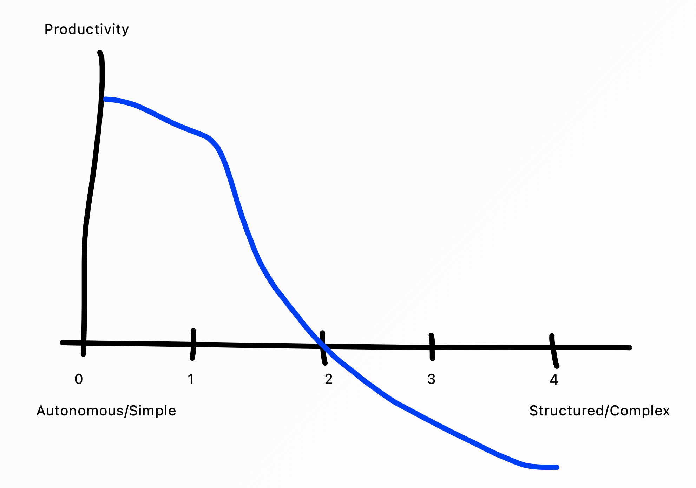

## From Vibes to Viability

The Context: **The "Vibe Coding" Honeymoon is Over**

The early *vibe coding* days are over. The fast, loose, unstructured way of "just talking to the AI, going with the vibe and seeing where it lands" is showing cracks. Vibing felt new, creative, and sometimes led to amazing showcases. But as the honeymoon fades, it's clear this isn't a sustainable or professional approach. Without structure, shared intent, and ownership, the results become inconsistent, unsafe, and unmaintainable. It's a shortcut that doesn't scale.

*Read: [Vibe Coding, Six Months Later: The Honeymoon's Over](https://thenewstack.io/vibe-coding-six-months-later-the-honeymoons-over/)*

*Read: [Inventor of Vibe Coding Admits He Hand-Coded His New Project](https://futurism.com/artificial-intelligence/inventor-vibe-coding-doesnt-work)*

---

### The Thesis: **Autonomy is only viable with Structure**

My drawn "Autonomy vs. Structure" tries to make this tension visible. *Vibe coding* lives in the red zone — high autonomy, low structure — where things look impressive for a moment but collapse under real-world demands.
The goal is to move into the green zone: *viable engineering*, where increasing AI autonomy is balanced by stronger structure, shared governance, and common principles.

**The back story:** The more that AI takes over bigger parts of the work (the more autonomous it operates for longer periods), the more structure is needed to guide it safely. It's basically the DevOps story—if you automate, you go faster and can do more harm fast if you do it wrong. That's why automation needs visibility, accountability, and quality gates. Same pattern applies here.

As someone wrote: **"AI is an amplifier that will boost the volume of your software delivery capability, whether good or bad."**

---

### The 4 + 1 Layer Mental AI Model

To make sense of that balance, I created a model with five layers that describe how humans and AI can collaborate at different maturity levels:

| **Layer** | **Focus** |
|-----------|------------|
| **0 – Explore** | Curiosity and idea discovery – shaping intent before building. |
| **1 – Assisted** | Augmented coding – using AI for smaller, well-defined tasks. |
| **2 – Agentic** | Working with reasoning agents – co-designing and solving more complex problems together. |
| **3 – Autonomous** | Guard-railed automation – delegating repeatable work safely. |
| **4 – Proactive (future)** | Self-managing systems that spot opportunities and improve themselves within set limits. |

---

### What "Structure" Actually Means

Structure and autonomy are not contradictions—one enables the other. Under "structure" I mean concrete aspects like:

- **Ownership** – Who's responsible when things break?
- **Architectural intent** – You guide the AI with YOUR plan, not the other way around
- **Safety** – Rules and constraints that prevent harm
- **Proven rule sets** – Agent rules, design guidelines, and skills (both human and AI) that work for your context

The more mature this gets, these structures need to scale for the team, and we need to learn and continuously adapt them (that's the governance aspect).

---

### What "Viable" Actually Means

I borrowed this term from the MVP world—a product is "viable" when it brings enough value to justify its existence. For AI-assisted development, viability means:

- Working smarter, faster, with better quality
- Keeping humans in the driver's seat—maintaining full control, learning, mentorship, and the craft of being an "agent zoo-director"
- Not going full YOLO on safety and security
- Considering the **means**, not just the outcome

Viability isn't just about raw productivity or output—it's about sustainable value creation that doesn't compromise what matters.

---

### The Tension: Speed vs. Sustainability

The core tension is simple: **as autonomy increases, so must structure.**

The "vibe zone" in red is seductive but fragile; the "viable zone" in green is where solid engineering practices meet intelligent automation.

**Reality Check:**

While vibe coding clearly 10x-ed the output (if you closed your eyes and just went with the flow), the performance gains of "real" AI-assisted coding are currently way lower. That's not just at zebbra, that's a wider picture you obviously don't see on LinkedIn and such ;-) Example: [METR AI Developer Study](https://metr.org/blog/2025-07-10-early-2025-ai-experienced-os-dev-study/)

So it's no secret that (some) members currently see things like this:

This is not unexpected, things get worse before they get better. It's still new land, so let's track this over time and see where we're at in a couple of months, once the foundations (learning new tools, establishing patterns, figuring out what works) have been built and experienced.

---

### This is Just the Beginning

This model is just a way to talk about this stuff and build common understanding. It's a mental model, not a mandate.

The goal is to use AI as a strong amplifier rather than a sweet-sounding shortcut. Human ownership, architectural intent, and shared principles are the tools we use to turn AI's "creative chaos" into viable, sustainable, and professional impact.

We're still figuring out what works, what doesn't, and what the right balance looks like. But I believe this conversation matters more than any single AI tool right now.
